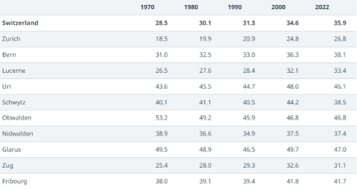
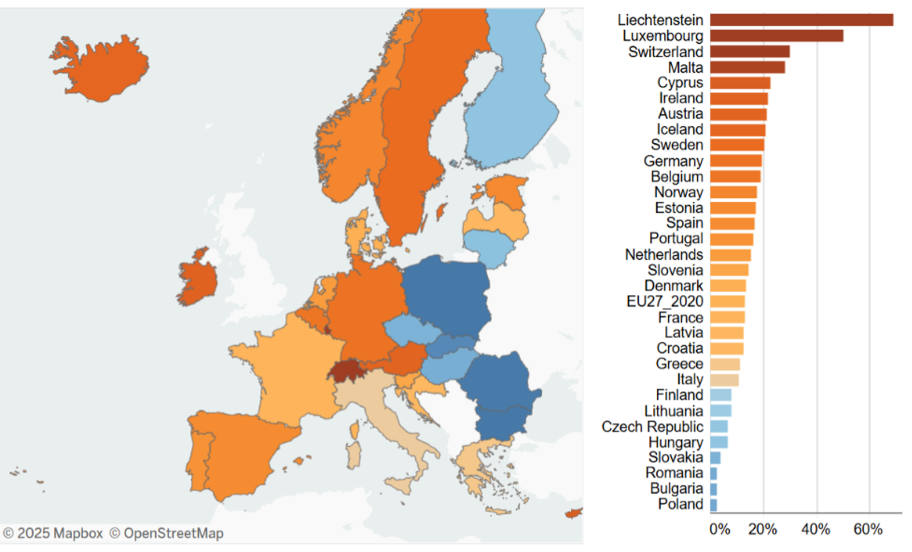

Moving to a new country is both exciting and challenging, and Switzerland, with its high living standards and fair economic opportunities, is no exception. However, for many foreigners, the question remains: Are these opportunities truly equal for everyone?
Education, employment, and property ownership are critical factors that shape quality of life. Yet, social differences, particularly for foreign nationals, play a significant role in accessing these opportunities.
This article explores key questions such as: Does higher education genuinely lead to a more comfortable life? Do foreigners in Switzerland have the same chances for employment and property ownership as citizens?
By addressing these questions, we aim to provide both a thoughtful analysis and a reflection of the shared experiences of those striving to build a better life in Switzerland.

Let’s begin with our first question: 


```{r setup, include=FALSE}
knitr::opts_chunk$set(echo = FALSE)
```

```{r message=FALSE}
# Data Preparation
# Loading Libraries, Functions, and Decoding Info
library(dplyr)
library(ggplot2)
library(RColorBrewer)
source("chart_functions.R")
source("decode_lists.R")
```

```{r}
# Loading data
zp_merged_data <- read.csv("data/zp_merged_data.csv")  # individual-level data
hh_merged_data <- read.csv("data/hh_merged_data.csv")  # household-level data
```

```{r}
# Merging the Data sets
merged_data <- hh_merged_data %>%
  left_join(zp_merged_data, by = c("HOUSEHOLDYEARLYID" = "HOUSEHOLDYEARLYID",
                                   "YEAR_QUIZ" = "YEAR_QUIZ"))
```

```{r}
# Decoding the data
merged_data <- decode(merged_data, HIGHESTCOMPLEDU, education_level)
merged_data <- decode(merged_data, IN_EDUCATION, in_edu)
merged_data <- decode(merged_data, CURRACTIVITYSTATUSIII, activity_status)
merged_data <- decode(merged_data, NATIONALITYCAT, nationality_category)
merged_data <- decode(merged_data, RESIDENTPERMIT, permit)
merged_data <- decode(merged_data, SECCITIZENSHIP, citizen)
merged_data <- decode(merged_data, TYPEOFOWNERSHIP, owner_ship)
merged_data <- decode(merged_data, NATIONALITYCONTI, nationality_conti)
```

```{r}
merged_data <- merged_data %>% 
  mutate(Employment_Type = as.factor(CURRACTIVITYSTATUSIII))
```

```{r}
# Creating Age groups
merged_data$AGE_GROUP <- cut(
  merged_data$AGE,
  breaks = c(15, 25, 40, 55, Inf), 
  right = FALSE, 
  labels = c("15-25", "25-40", "40-55", "55 +")
)
```

```{r}
merged_data <- merged_data %>%
  mutate(TYPEOFOWNERSHIP = case_when(
    TYPEOFOWNERSHIP %in% c("Condominium owner", "House owner") ~ "Owner",
    TYPEOFOWNERSHIP %in% c("Tenant") ~ "Renter",
    TYPEOFOWNERSHIP == "Other situation" ~ "Other situation",
    TRUE ~ NA_character_))
```


```{r}
# Extracting only the necessary data
education_employment_data <- merged_data %>% 
  select(AGE_GROUP, HIGHESTCOMPLEDU, Employment_Type, IN_EDUCATION, YEAR_QUIZ)
```

```{r}
# Filter and Clean Data
education_employment_data <- education_employment_data %>%
  filter(
    !is.na(HIGHESTCOMPLEDU),
    !is.na(AGE_GROUP),
    !is.na(IN_EDUCATION),
    !is.na(Employment_Type)
  )
```
#  Does Education Influence Employment?

life. But is this assumption accurate? Can pursuing higher education truly lead to a lifestyle that allows for more time with loved ones and hobbies?

The answer to this question is valuable to us, as the result may help us choose a path in life depending on our perspective. That’s why we want to examine this question more closely.

First, let’s take a closer look at the Swiss education system. In many cantons, students aged 14-15 face a big choice after lower secondary school. Some quarters pressure children to pursue the general education route for prestige reasons. Most pupils on this track attend a Swiss high school and take the Swiss Baccalaureate, which prepares them for university. [(source)](https://www.swissinfo.ch/eng/sci-tech/the-swiss-education-system-explained/48148948)

The education system in Switzerland is flexible. Now, let's look at how it has changed over the years.
```{r}
data_with_proportions_edu <- education_employment_data %>%
  mutate(HIGHESTCOMPLEDU = factor(
    HIGHESTCOMPLEDU, 
    levels = c("Higher Ed", "Higher VET", "Basic VET", "Secondary", "Compulsory", "None")
  )) %>%
  group_by(YEAR_QUIZ) %>%
  mutate(Total = n()) %>% 
  group_by(YEAR_QUIZ, HIGHESTCOMPLEDU) %>%
  summarise(Count = n(), Proportion = Count / first(Total), .groups = "drop")

ggplot(data_with_proportions_edu, aes(x = YEAR_QUIZ, y = Proportion, fill = HIGHESTCOMPLEDU)) +
  geom_bar(stat = "identity", position = "fill", color = "black") +
  geom_text(aes(label = scales::percent(Proportion, accuracy = 1)),
            position = position_fill(vjust = 0.5), size = 3) +
  scale_fill_brewer(palette = "Set3") +
  theme(
    axis.text.x = element_text(angle = 45, hjust = 1),
    axis.line = element_line(size = 1.5)
  ) +
  labs(
    title = "Level of Highest Education Over the Years",
    x = "Year",
    y = "Proportion"
  ) +
  coord_flip()
```

From the charts, it is shown that vocational education remains popular across generations due to its ability to prepare individuals for the workforce at an early age. According to [work.swiss](https://www.arbeit.swiss/secoalv/en/home/menue/stellensuchende/berufliche-mobilitaet-in-der-eu-efta---eures/aus-und-weiterbildung.html) These programs offer both theoretical knowledge and practical skills, enabling young people to start their careers earlier and achieve financial independence which is an amazing and unique education type that doesn’t exist in most countries. However, we also observe that with years people are starting to focus more on higher education. So, what could be the reason for this shift?

**Could it be that new generations focus on higher education to enjoy more leisure time in the future?**

This perspective suggests they may seek higher education to secure jobs with better work-life balance and flexibility.

In contrast, university graduates generally spend more time pursuing advanced qualifications, leading to delayed workforce entry. Despite this delay, their higher earning potential can enable them to work fewer hours while maintaining a comparable or even higher standard of living. This trend suggests that the extended education period may provide long-term benefits in terms of work-life balance.

Examining these dynamics requires an analysis of employment trends, income levels, and work-life balance across educational backgrounds to determine whether people with higher education truly experience greater flexibility and fewer working hours in their professional lives. 

Now, let’s take a closer look at the chart, which provides a detailed analysis of employment types by education levels across different generations.

```{r}
data_with_proportions <- education_employment_data %>%
  group_by(AGE_GROUP, HIGHESTCOMPLEDU) %>%  
  mutate(Total = n()) %>% 
    mutate(HIGHESTCOMPLEDU = factor(
    HIGHESTCOMPLEDU, 
    levels = c("None", "Compulsory", "Secondary", "Basic VET", "Higher VET", "Higher Ed")
  )) %>%
  group_by(AGE_GROUP, HIGHESTCOMPLEDU, Employment_Type) %>% 
  summarise(Count = n(), Proportion = Count / first(Total), .groups = "drop") 

ggplot(data_with_proportions, aes(x = AGE_GROUP, y = Proportion, fill = Employment_Type)) +
  geom_bar(stat = "identity", position = "fill") +
  geom_text(aes(label = scales::percent(Proportion, accuracy = 1)), 
            position = position_fill(vjust = 0.5), size = 3) +
  facet_wrap(~HIGHESTCOMPLEDU) +
  theme(
    axis.text.x = element_text(angle = 45, hjust = 1), 
    axis.line = element_line(size = 1.5)
  ) +
  scale_fill_brewer(palette = "Spectral") +
  labs(
    title = "Distribution of Employment Types by Education Level",
    x = "Education Level",
    y = "Proportion",
    fill = "Employment Type"
  )
```
According to this chart, we can see that education level has a significant impact on employment. Individuals with lower education levels have much lower employment rates compared to those with VET or higher education. This indicates that the income earned by individuals with lower education levels is sufficient for them to maintain their lives at their current employment level.

We initially thought that highly educated individuals would have lower employment rates and achieve better work-life balance, but this assumption turned out to be incorrect. According to data from [admin.ch](https://www.bfs.admin.ch/asset/en/30226036), we found that people with higher education earn significantly more and can afford better living conditions while working less compared to those with lower education levels. In this case, working more becomes a personal preference for highly educated individuals. 

The reason for working extensively may not be just to have more free time in the future. Some highly educated individuals may have different perspective of life. Perhaps you’ve heard of the term workaholic, which simply means being addicted to work or power they reached. I believe this may explain why highly educated individuals, even those over the age of 55, have higher rates of working full-time compared to 55+ year-olds in other education levels, despite having higher earning potential. Their inability to stop working may be rooted in an addiction to productivity and achievement.

This is, of course, a significant psychological factor, but we want to place a greater focus on the material aspect.

The desire for property ownership may also be a reason for pursuing higher education. To better understand the connection between education level and property ownership, we ask the following question:


# Is There a Link Between Higher Education and Property Ownership?

```{r}
complete_edu_and_ownership <- merged_data %>%
  select(HIGHESTCOMPLEDU, AGE_GROUP, TYPEOFOWNERSHIP, YEAR_QUIZ, AGE)
```

```{r}
complete_edu_and_ownership <- complete_edu_and_ownership %>%
  filter(
    !is.na(HIGHESTCOMPLEDU),
    !is.na(AGE_GROUP),
    !is.na(TYPEOFOWNERSHIP)
  )
```

While examining the relationship between property ownership and education, it’s equally important to consider the influence of time. Economic shifts over the years have profoundly impacted homeownership rates in Switzerland.

As a group of individuals from different nationalities, we all agree that buying a house is much harder now from a global perspective. We assume that this trend has similarly affected Switzerland.

[According to Raphaël Gabella](https://www.swissinfo.ch/eng/workplace-switzerland/owning-a-home-becomes-increasingly-difficult-in-switzerland/77500922), (CIFI)

***“Whatever your age, it’s getting more and more complicated. Prices have more than doubled in 25 years. But salaries have risen by 30-40% in 25-30 years. The rules for granting credit are also increasingly restrictive,”***

These challenges highlight the growing gap between income levels and property prices, making home ownership a more difficult goal for today’s population compared to previous generations. However, the data below reveals an unexpected outcome.



According to the information from the [Swiss Federal Statistical Office (BFS)](https://www.bfs.admin.ch/bfs/en/home/statistics/construction-housing/dwellings/housing-conditions/tenants-owners.html), it is shown that, contrary to expectations, homeownership rates in Switzerland have actually increased over the years.

This increase could potentially be attributed to earlier generations, who were able to purchase homes more easily due to favorable economic conditions at the time, and subsequently passed these properties down to their descendants, thereby contributing to the rise in home ownership rates today.

Besides considering the years, examining the connection between age and home ownership can help us understand how different life stages, financial stability, and generational factors influence the ability to own property. 

From the previous charts, we observed that age has a strong correlation with education level and employment type. Based on this, it is reasonable to predict a deep correlation between age and property ownership as well.  Now, we will take a closer look at the relationship between age and homeownership using boxplots. The median values are particularly important because they represent the middle point of the data, providing a clearer indication of what is typical, as they are not affected by outliers. Therefore, our focus here will be on medians.

```{r, warning=FALSE}
summary_table <- complete_edu_and_ownership %>%
  group_by(TYPEOFOWNERSHIP) %>%
  summarise(
    mean_age = mean(AGE, na.rm = TRUE),
    median_age = median(AGE, na.rm = TRUE)
  )

complete_edu_and_ownership %>%
  ggplot(aes(x = TYPEOFOWNERSHIP, y = AGE, fill = TYPEOFOWNERSHIP)) +
  geom_boxplot(outlier.shape = 16, outlier.size = 2) +
  geom_text(
    data = summary_table,
    aes(
      x = TYPEOFOWNERSHIP,
      y = mean_age,
      label = paste0("Mean: ", round(mean_age, 1))
    ),
    color = "black",
    vjust = -2.5,
    size = 3
  ) +
  geom_text(
    data = summary_table,
    aes(
      x = TYPEOFOWNERSHIP,
      y = median_age,
      label = paste0("Median: ", round(median_age, 1))
    ),
    color = "black",
    vjust = 1.5,
    size = 3
  ) +
  labs(
    title = "The Relationship Between Age and Ownership Status",
    x = "",
    y = "AGE"
  ) +
  theme_minimal() +
  theme(
    axis.text.x = element_text(angle = 45, hjust = 1),
    axis.line = element_line(color = "black", size = 1.5),
    panel.grid = element_blank()
  ) +
  scale_fill_brewer(palette = "Set3")
```
The boxplots provide evidence to support this idea. The median values demonstrate that older individuals are more likely to own property, which is not surprising. Additionally, the shorter length of the owner plot indicates that the age variation among property owners is smaller compared to other groups. On the other hand, younger generations may prioritize work-life balance and flexible career paths over property ownership, preferring to rent instead.

The reason older generations have high home ownership rates might also be their preference for staying in one place. According to the information from [Neighborhood Rio Rancho](https://www.neighborhoodriorancho.com/article/what-challenges-do-older-adults-face-when-moving/), as people age, moving away from their current location becomes more challenging due to psychological and physical factors. As a result, they tend to prefer living in a stable and permanent location. We do not expect this trend to change significantly in the coming years.

We also observe that the "Other Situation" category, where individuals live with their families or in inherited homes, has a lower median age of 30 and shows more variation in ages. This could be due to passing down property to future generations. Inherited homes make it easier for younger people to become home owners and help explain the rise in ownership rates despite higher house prices.

After observing the impact of age on ownership type, we can explore whether the likelihood of owning a home increase with age depending on individuals' education levels. 

As observed in previous charts, Age significantly affects education, employment, and property ownership. Younger individuals still completing their education and entering the workforce are excluded from this analysis, as their data is incomplete.

**Can education be the key to achieving home ownership?**

From my perspective as someone from an Asian country, higher education is considered extremely important, and most people tend to follow the same path of pursuing a bachelor’s degree. This belief is driven by the idea that it is the only way to achieve our dreams and become homeowners, even if our strengths lie outside traditional academic learning—and, in many cases, it truly is the only way. Similarly, I believe that education levels play a significant role in homeownership opportunities in Switzerland.

That’s why I found it fascinating that vocational education and training (VET) is so popular in Switzerland. In my country, higher education is often seen as the most important factor for financial success, whereas in Switzerland, it seems that VET education might play a similar role. As previously mentioned, VET-trained individuals enter the workforce at a much younger age. By beginning their careers sooner, they can start accumulating savings and planning for major investments like property ownership well before their highly educated counterparts. Given the differences I have observed in my own country, I am particularly interested in exploring the distinctions between VET and higher education in greater detail.

In the chart below, we will seek to answer this question:

** Does the type of education truly influence the likelihood and timing of property ownership?**

```{r, warning=FALSE}
grouped_data <- complete_edu_and_ownership %>%
filter(AGE_GROUP != "15-25") %>% 
  mutate(HIGHESTCOMPLEDU = factor(
    HIGHESTCOMPLEDU, 
    levels = c("None", "Compulsory", "Secondary", "Basic VET", "Higher VET", "Higher Ed")
  )) %>%
  group_by(AGE_GROUP, HIGHESTCOMPLEDU, TYPEOFOWNERSHIP) %>%
  summarise(Count = n(), .groups = "drop_last") %>% 
  mutate(Proportion = Count / sum(Count))

ggplot(grouped_data, aes(x = HIGHESTCOMPLEDU, y = Proportion, fill = TYPEOFOWNERSHIP)) +
  geom_bar(stat = "identity", color = "black") +
  geom_text(
    aes(label = scales::percent(Proportion, accuracy = 0.1)), 
    position = position_stack(vjust = 0.5), 
    size = 2.3
  ) +
  facet_wrap(~ AGE_GROUP, scales = "free") +
  scale_fill_brewer(palette = "Set3") +
  labs(
    title = "Ownership Types by Age Group and Education Level",
    x = "Age Group",
    y = "Proportion"
  ) +
  theme(axis.text.x = element_text(angle = 45, hjust = 1))
```

Our findings reveal an intriguing pattern among young adults and adults with varying education levels. Individuals with lower education, especially those who have completed vocational education and training (VET), are more likely to own homes at a younger age. Their earlier entry into the workforce allows them to build financial resources and achieve stability sooner.  The chart indicates that highly educated individuals eventually catch-up VET-educated counterparts in homeownership rates after gaining significant work experience, but VET-educated individuals continue to maintain relatively high homeownership rates across all age groups. This also explains the popularity of VET programs in Switzerland. 

At the same time, the charts show that individual's high education have lower ownership rates, particularly during the [prime working years of their careers (ages 25-55)](https://www.oecd.org/en/data/indicators/employment-rate-by-age-group.html#:~:text=Employment%20rates%20are%20shown%20for,of%20their%20career%20and%20approaching).

The results show that in Switzerland, you don’t have to focus solely on higher education to own a house. You can still become a homeowner by doing a job you enjoy—perhaps even more easily.

The relatively low ownership rates among highly educated adults, which we did not expect, raise an important question:

**If property ownership is the primary goal, is pursuing a bachelor’s or university degree in Switzerland truly worth it? And why have people increasingly started to focus on higher education?**

Of course, education is not solely about gaining free time or owning property. It enhances an individual’s self-esteem and is considered a fundamental aspect of personal growth and fulfilment for many. However, combining the intrinsic benefits of education with greater opportunities for property ownership and an improved work-life balance would be the ideal scenario.

Additionally, technological changes and economic transformations, particularly the effects of automation and digitalization on reducing job opportunities in some sectors, may impact the career prospects of VET graduates. According to [CNN](https://edition.cnn.com/2024/06/20/business/ai-jobs-workers-replacing/index.html) More than half (61%) of large firms plan to use AI within the next year to automate tasks previously done by employees.

At the same time, it could be argued that individuals with VET education are less focused on pursuing ambitious career advancements compared to university graduates. As a result, they may experience less geographical or job mobility, allowing them to remain in their current locations for longer periods. This stability could increase their likelihood of becoming home owners.

**So, which other factors influence homeownership?**

After examining the role of education, we wanted to explore whether being a foreigner has an impact on property ownership. As you may have noticed, Switzerland has a remarkably high proportion of foreign residents (30%). 

According to data from [NCCR On The Move](https://nccr-onthemove.ch/indicators/what-is-the-proportion-of-foreign-born-populations-in-switzerland-and-europe/) , Switzerland ranks third in Europe for its foreign-born population. As foreign individuals, this aspect is particularly relevant and worth further investigation.


As evident from the migrant and local population graph, the foreign population in Switzerland is significantly high and plays a crucial role in shaping the dynamics of homeownership. This factor cannot be overlooked in our analysis and is particularly interesting for our multicultural team.

Now that we understand the importance of the foreign population, we can ask this question: 

# How does nationality influence homeownership rates in Switzerland?

```{r}
home_owner_data <- merged_data %>% select(SECCITIZENSHIP, TYPEOFOWNERSHIP,
    SIZEOFPRIVATEHOUSEHOLD, NATIONALITYCAT, NATIONALITYCONTI
  )
```

```{r}
home_owner_data <- home_owner_data %>%
  filter(
    !is.na(NATIONALITYCAT),
    !is.na(SIZEOFPRIVATEHOUSEHOLD),
    !is.na(TYPEOFOWNERSHIP)
  )
```

```{r}
# Group household size
home_owner_data <- home_owner_data %>%
  mutate(
    SIZEOFPRIVATEHOUSEHOLD_GROUP = case_when(
      SIZEOFPRIVATEHOUSEHOLD == 1 ~ "1 member",
      SIZEOFPRIVATEHOUSEHOLD >= 2 & SIZEOFPRIVATEHOUSEHOLD <= 3 ~ "2-3 members",
      SIZEOFPRIVATEHOUSEHOLD >= 4 ~ "4+ members",
      TRUE ~ NA_character_
    )
  ) %>%
  filter(!is.na(SIZEOFPRIVATEHOUSEHOLD_GROUP))
```

Homeownership is a cornerstone of financial security, social stability, and personal investment. In Switzerland, where foreign residents make up one of the highest proportions in Europe. 

This analysis aims to answer a key question: How does nationality influence homeownership rates in Switzerland, and what systemic factors drive the disparities observed? 

As foreigners, we often have to work harder to achieve the goals we aspire to in Switzerland, and this effort extends to homeownership as well. According to the [Swiss Federal Statistical Office (FSO)](https://www.bfs.admin.ch/bfs/en/home/statistics/construction-housing.html), foreign nationals experience significantly lower homeownership rates compared to Swiss citizens. By examining the chart, we can gain a deeper understanding of how nationality and Swiss residency status influence different types of homeownerships.  

```{r, message=FALSE}
plot1 <- create_proportional_plot(
  data = home_owner_data,
  group_var = "NATIONALITYCAT",
  fill_var = "TYPEOFOWNERSHIP",
  y_var = "proportion",
  title = "Proportion of Homeownership by Nationality",
  x_label = "Nationality",
  y_label = "Proportion"
)
print(plot1)
```

The data reveals a stark divide between Swiss nationals and foreign residents in homeownership. While 50.3% of Swiss citizens own property (comprising house and condominium ownership), a striking 77.6% of foreign residents remain tenants. In contrast, only 19.7% of foreign residents have achieved homeownership, highlighting significant disparities in property access. Additionally, foreign residents are more likely to fall under the "Other situation" category (2.7%) compared to Swiss nationals (4.2%), which may reflect further instability or alternative living arrangements.

We believe foreign residents face considerable challenges when it comes to homeownership. Restrictive legal rules, limited financial options, and tougher credit requirements make the process far more difficult. To us, this clearly shows how deeply nationality impacts housing inequality and limits access to stable living opportunities. 

Having understood that foreign individuals face more challenges in becoming homeowners compared to Swiss nationals, let us now analyze these foreign individuals in greater detail. Switzerland, as a European country, shares more similarities with other European nations than with countries from other regions. In this context, it is believed that European individuals have a relatively easier path to homeownership. Furthermore, according to information from [ch.ch](https://www.ch.ch/en/housing/homeownership/buying-property/purchasing-property-in-switzerland-as-a-foreign-na) the conditions for buying property vary for individuals from different countries. For citizens of EU countries, they are granted the same rights as Swiss nationals when purchasing a house. 

```{r, message=FALSE}
# 8.2 Example: Proportions by Continent of Nationality and Ownership
plot2 <- create_proportional_plot(
  data = home_owner_data %>%
    filter(
      !(NATIONALITYCONTI %in% c("Switzerland", NA, "Stateless")) 
    ),
  group_var = "NATIONALITYCONTI",
  fill_var = "TYPEOFOWNERSHIP",
  y_var = "proportion",
  title = "Homeownership by Continent",
  x_label = "Continent of Nationality",
  y_label = "Proportion"
)
print(plot2)
```

This chart on homeownership by continent highlights significant disparities across different regions. For instance, residents from **Africa** exhibit the highest proportion of tenants, with **91.1%** renting rather than owning property. Similarly, **Asia** also shows a high tenancy rate at **81.7%**, while ownership (house or condominium) remains relatively low. 

In contrast, **EFTA member states** (e.g., Switzerland, Norway) and **EU member states** demonstrate significantly higher homeownership rates, with **29.4%** and **13.3%** house ownership, respectively. These regions also exhibit a larger share of condominium ownership compared to other continents, reflecting possibly easier access to property markets due to stronger economic integration or legal benefits. 

**North America** and **Latin America** show somewhat balanced distributions, with tenant proportions of **72.7%** and **74.7%**, respectively. Notably, **Oceania** stands out with a relatively higher rate of homeownership (house and condominium combined, **29.1%**), while the tenancy rate remains lower than Africa or Asia at **68.1%**. 

Lastly, individuals from **Other Europe** regions, outside of EU and EFTA membership, have the highest proportion of tenants at **86.2%**, reflecting economic or legal barriers that limit their access to ownership opportunities. 

Are there other significant factors influencing homeownership? We believe that individuals living with large families are more likely to become homeowners. This could be because larger family units often prioritize stability and long-term investments, such as owning a home, to accommodate their needs. 

Now, let us delve deeper into this situation to explore whether there is indeed a relationship between the number of individuals in a family and homeownership rates. Additionally, we will examine whether this relationship varies across different nationalities, providing further insight into how cultural and economic factors may influence these trends. 

```{r, warning=FALSE}
# 8.4 Example of summarizing by household size
plot3 <- create_proportional_plot(
  data = home_owner_data, 
  group_var = "NATIONALITYCAT",
  fill_var = "TYPEOFOWNERSHIP",
  y_var = "proportion", 
  title = "Homeownership by Nationality and Household Size",
  x_label = "Nationality",
  y_label = "Proportion",
  facet_var = "SIZEOFPRIVATEHOUSEHOLD_GROUP"
)
print(plot3)
```

From the Homeownership by Nationality and Household Size chart, we can see that, among households with four or more members, a clear disparity emerges: while 64% of Swiss nationals in this group own their homes, only 26.2% of foreign households achieve the same. Even in single-member households, Swiss nationals are significantly more likely to own a home (26.8%) compared to foreign residents, where ownership drops to just 9.1%. However, in both cases, larger households show higher homeownership rates compared to single-member households, suggesting that family size plays a significant role in the likelihood of owning a home, regardless of nationality. 

From these charts, we assume that nationality significantly impacts homeownership rates in Switzerland. Swiss nationals benefit from more favorable conditions, such as easier access to credit and fewer legal restrictions, while foreign residents face systemic barriers that limit their opportunities. Additionally, larger Swiss households appear to leverage pooled resources for property investment, whereas foreign families seem less able to do so, likely due to financial instability or exclusion. These disparities suggest that both structural and cultural factors play a crucial role in shaping housing access. 

The disparities in homeownership rates have profound implications for Switzerland’s future. Addressing these inequities requires systemic reform. Legal barriers that restrict foreign residents from purchasing property must be reconsidered, and credit restrictions need to be eased to provide equitable access to financing. Additionally, targeted incentives for first-time buyers—especially those from migrant backgrounds—could foster greater social integration and economic stability. 

Ultimately, fostering an equitable housing market is about more than just fairness. It’s about building a society where everyone, regardless of nationality, can achieve stability and invest in their future. By addressing systemic barriers, Switzerland can create a more inclusive and resilient housing market, ensuring that homeownership becomes an attainable goal for all its residents. 


# The Impact of Restrictions on Foreign Nationals Regarding Housing and Workload

```{r}
# Selecting Variables for Chart Building
work_loading_data <- merged_data %>% select(RENTNET,NATIONALITYCAT,TIMEWORKEDPERWEEKSUM, RESIDENTPERMIT)
```

```{r}
# Filtering Extreme High RENTNET Values and NA
work_loading_data <- work_loading_data %>% filter((RENTNET < 5000 | RENTNET == -8) &
                                            !is.na(NATIONALITYCAT) &
                                            !is.na(RESIDENTPERMIT) &
                                            TIMEWORKEDPERWEEKSUM >= 0)
```

As mentioned earlier, foreigners in Switzerland often encounter certain obstacles on their path to purchasing property. Despite relatively high salaries compared to many other countries, the cost of real estate here remains among the highest in Europe, and legal constraints further complicate the buying process for those without a Swiss passport. Consequently, **a significant number of foreigners end up renting for an extended period.** According to [Swissinfo](https://www.swissinfo.ch/eng/business/making-ends-meet_how-far-do-6-000-francs-really-get-you-in-switzerland/43666358?utm_source=chatgpt.com), an average of 20–30% of a person’s monthly income goes toward housing. It’s no surprise, then, that those who can’t afford their own place end up spending a noticeable portion of their budget on rent.

In **Chart “Distribution of rent payment by nationality categories”**, you can see a comparison of homeownership versus renting in two groups: Swiss citizens and all foreign nationals. Pay attention to how the percentage of homeowners differs between these categories: the proportion of homeowners is traditionally higher among locals, while among migrants, renting dominates.

```{r}
rent_analysis <- work_loading_data %>%
  filter(!is.na(NATIONALITYCAT)) %>%
  mutate(
    pays_rent = case_when(
      RENTNET > 0 ~ "Pays Rent",
      RENTNET < 1 | is.na(RENTNET) ~ "Does Not Pay Rent"
    )
  ) %>%
  group_by(NATIONALITYCAT, pays_rent) %>%
  summarise(count = n(), .groups = "drop") %>% 
  group_by(NATIONALITYCAT) %>% 
  mutate(percentage = round(count / sum(count) * 100,2)) %>%
  ungroup()

ggplot(rent_analysis, aes(x = pays_rent, y = percentage, fill = NATIONALITYCAT)) +
  geom_bar(stat = "identity", position = "dodge") +
  geom_text(
    aes(label = round(percentage, 2)),
    position = position_dodge(width = 0.9),
    vjust = -0.5,                    
    size = 3
  ) +
  scale_fill_brewer(palette = "Spectral")+
  labs(title = "Distribution of rent payment by nationality categories",
       x = "Category of nationality",
       y = "Number",
       fill = "Rent payment status") +
  theme_minimal()
```

This demonstrates that foreigners often require sufficient income to cover monthly expenses. One solution is to work longer hours or even hold multiple jobs. This highlights the connection between nationality and workload, supporting the hypothesis that foreigners tend to work more than the local population—a perspective shaped by both my own experience and that of my colleagues. 

**More Hours per Week—A Minor Difference or a Substantial Burden?** 

To verify whether foreigners truly work more, we prepared **Chart “Comparison of Working Hours by Nationality”**, where we compared the average and median number of working hours for two groups: “Swiss” (Swiss citizens) and “Foreigners” (migrants). 

```{r, warning=FALSE}
work_loading_data %>%
  filter(!is.na(TIMEWORKEDPERWEEKSUM) & !is.na(NATIONALITYCAT)) %>% 
  group_by(NATIONALITYCAT) %>% 
  ggplot(aes(x = NATIONALITYCAT, y = TIMEWORKEDPERWEEKSUM, fill = NATIONALITYCAT)) +
  geom_boxplot() +
  scale_fill_brewer(palette = "Spectral")+
  stat_summary(
    fun = median,
    geom = "text",
    aes(label = paste("Med:", round(..y.., 1))),  
    vjust = -1.5,
    hjust = 1.5,
    color = "black",  
    size = 4
  ) +
  stat_summary(
    fun = mean,
    geom = "text",
    aes(label = paste("Mean:",round(..y.., 1))),  
    vjust = 1.5,
    hjust = 1.09,
    color = "black",  
    size = 4
  ) +
  labs(
    title = "Comparison of Working Hours by Nationality",
    x = "Nationality",
    y = "Weekly Working Hours"
  ) +
  theme_minimal()
```
It clearly shows that migrants on average work about one hour longer at the median, and around 2.2 hours longer when looking at the mean. At first glance, one or two extra hours per week may seem trivial. But over the course of a year, that can amount to nearly 115 additional working hours, which equates to about five extra working days (a full working week!). Even such small shifts in the balance can, over time, affect health, leisure, or family life. 

Yet economic need alone—i.e., “earning more”—is not the only explanation for why foreigners tend to work overtime. According to [SEM (State Secretariat for Migration)](https://www.sem.admin.ch/sem/en/home/themen/arbeit/nicht-eu_efta-angehoerige/grundlagen_zur_arbeitsmarktzulassung.html), there is a hierarchical priority in Switzerland requiring employers to first consider Swiss nationals, EU/EFTA citizens, or those who already have certain residence permits granting expanded work rights. 

According to the data from the [Foreign Population and Asylum Statistics 2022](https://www.google.com/url?sa=t&source=web&rct=j&opi=89978449&url=https://www.sem.admin.ch/dam/sem/en/data/publiservice/statistik/bestellung/auslaender-asylstatistik-2022.pdf.download.pdf/auslaender-asylstatistik-2022-e.pdf&ved=2ahUKEwihkt_a2YaLAxW50gIHHQo7OMgQFnoECBYQAQ&usg=AOvVaw2FoomEPpvIH8jEBykFVMSo) (SEM, page 20), most migrants in Switzerland hold residence permits of categories B and C, while the rest we group under “Others”. For a more detailed analysis, we will examine the average number of hours worked per week for these groups compared to the local population.  

```{r}
mean_by_permit <- work_loading_data %>% 
  filter(!is.na(TIMEWORKEDPERWEEKSUM) & !is.na(NATIONALITYCAT)) %>% 
  mutate(
    PERMIT_GROUP = case_when(
      RESIDENTPERMIT == "Permit B" ~ "Permit B",
      RESIDENTPERMIT == "Permit C" ~ "Permit C",
      RESIDENTPERMIT == "Swiss" ~ "Swiss",
      TRUE ~ "Others" # Всі інші дозволи об'єднуємо в групу "Others"
    )
  ) %>% 
  select(PERMIT_GROUP, TIMEWORKEDPERWEEKSUM) %>% 
  group_by(PERMIT_GROUP) %>% 
  summarise(mean_time = round(mean(TIMEWORKEDPERWEEKSUM, na.rm = TRUE), 2), .groups = "drop") %>% 
  arrange(desc(mean_time))

ggplot(mean_by_permit, aes(x = reorder(PERMIT_GROUP, -mean_time), y = mean_time, fill = PERMIT_GROUP)) +
  geom_bar(stat = "identity") +
  geom_text(
    aes(label = round(mean_time, 1)),  
    vjust = -0.5,                   
    size = 3
  ) +
  scale_fill_brewer(palette = "Set2") +
  labs(
    title = "Mean work time per week by permit group",
    x = "Permit group",
    y = "Mean work time per week"
  ) +
  theme_minimal() +
  theme(axis.text.x = element_text(angle = 45, hjust = 1)) +
  guides(fill = "none")

print(mean_by_permit)
```
In **Chart “Mean work time per week by permit group”** that follows, we depict than, Permit B “leads” with an average of around 38–39 hours per week. Those with Permit C hover near that level (around 37.6 hours), and only holders of other statuses (“Others”) show a slightly lower level of employment (around 37 hours). Overall, however, all these groups exceed the figure for Swiss citizens (approximately 35.6 hours). 

This is not surprising: **the harder it is to obtain or renew a work permit**, the more motivated an individual is to prove themselves as an “indispensable” employee and keep their existing job. In addition, many foreigners want to demonstrate stable employment and a steady income, since this can improve their chances of eventually moving into a more “prioritized” category (for example, applying for a Permit C instead of B). 

**Conclusions and the Effect on Life Prospects**

Taken together, **Last 4 Charts** show a strong link between homeownership rates, rental costs, and the workload of foreign nationals: on the one hand, high housing costs and additional legal restrictions result in a greater tendency for renting, on the other, the need to cover rent and prove oneself indispensable to an employer leads to an **increase in working hours**. 

While a few extra hours per week may not seem like much, in annual terms it becomes quite significant. Foreigners invest more time in their jobs, often sacrificing personal life or additional learning opportunities—all in pursuit of stability and the right to remain in the country. Ultimately, this can become a vicious cycle: without stable income and steady employment, it’s difficult to buy property; yet without property ownership, people must work harder to afford rent. 


At the same time, it’s important to note that not all foreigners face equally challenging conditions. Much depends on their level of qualifications, language skills, length of stay in the country, and type of residence permit. Still, the overall trend is clear: **nationality and residence status in Switzerland have a notable impact on workload** and, as a result, on the ability to achieve long-term financial comfort and purchase property. 

---

In this blog, we conducted an in-depth analysis of Switzerland and sought answers to our questions. Some of the results did not align with our expectations, and as individuals who are just getting to know Switzerland, we were truly surprised by these findings. 

**To summarize the interesting findings:**  

We expected the employment rate to be lower among individuals with higher education levels, as we assumed their salaries would allow them to achieve work-life balance more easily. However, the data showed the opposite. We believed one reason for this could be psychological factors, while another possible explanation might be the desire for property ownership. 

However, while examining the relationship between education and homeownership, we were surprised to find that individuals with VET education tend to become home owners earlier than those with higher education levels. As we mentioned before, such an education system isn't popular in Asian countries. This finding highlight how efficient and effective Switzerland's education system truly is and explains the importance given to VET education. 

However, we noticed that over the years, VET education has been losing its popularity. Although it remains the most popular pathway, we see that people are increasingly focusing on higher education. Despite VET being such an efficient system, we believe the shift in focus might be due to technological advancements replacing many VET-related jobs, leading people to seek higher education as a way to protect their careers.  

Another striking observation is that, despite property prices rising faster than salaries in Switzerland, home ownership rates have increased over the years. We believe one of the main reasons for this trend is inheritance. 

Switzerland, which has the third-highest foreign population in Europe, benefits greatly from the contributions of its foreign residents to the economy. Nationality and citizenship play a key role in homeownership, with Swiss citizens and Europeans hold an advantage when it comes to owning property. This is because they often face fewer legal restrictions and have easier access to loans. Foreign residents often have higher employment rates than Swiss citizens due to their motivation to renew their residence permits and establish a stable life in Switzerland. Additionally, foreign workers bring valuable skills and fresh perspectives, which strengthen the economy and drive progress in various industries. These contributions underline the vital role of foreign residents in Switzerland's success while also highlighting the unique challenges they face when settling in a new country. 

As foreigners, we observed how different Switzerland is from our own countries in several aspects. These findings were incredibly interesting for us, and we hope you found them engaging as well. As a team, we hope that this blog will serve as a valuable resource for individuals looking to better understand Switzerland and shape their lives here. 